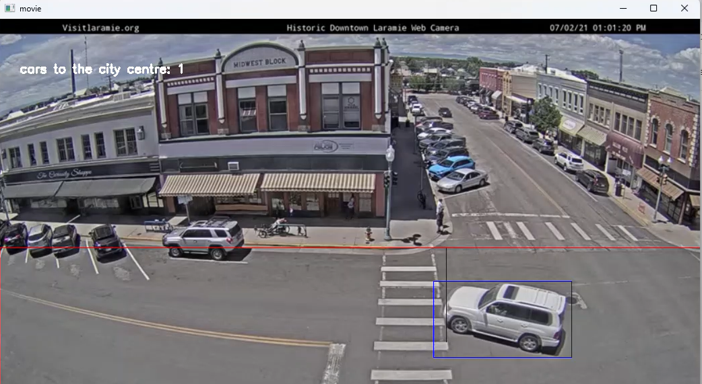

# End Term Exercise1

### 1. Description
    To develop a computer vision application for counting the number of cars that go from the city’s downtown to the city centre for a specific time interval.

    The application must run on a Jupyter notebook written in Python and use the OpenCV library.

    Technically, the algorithm of the application must be based on the frame differencing and background subtraction techniques.  

### 2. The Result
|mp4 file|Detected Cars to city centre|Cars per Minutes|
|---|---|---|
|Traffic_Laramie_1.mp4|6|2.03 = 6 / 2.95|
|Traffic_Laramie_2.mp4|4|2.29 = 4 / 1.75|

    2.1 Technical Background
    2.1.1 Frame differencing 
    - What is frame differencing techinique? 
        A technique where the computer checks the difference between two video frames 
        https://www.kasperkamperman.com/blog/computer-vision/computervision-framedifferencing/ 

    - How is this techinique used in my own application 
        Actually, my application compares same object's position in two different frames, not same point in different frames. 

    2.1.2 Background Substraction 
    - What is background substraction technique? 
        A common and widely used techinque for generatiing a foreground mask 
        https://docs.opencv.org/4.x/d1/dc5/tutorial_background_subtraction.html 

    - How is this techinique used in my own application? 
        By cv2.absdiff like below code  
        
        delta_frame = cv2.absdiff(initial_frame, blur_frame) 
        
        initial_frame is the frame generated from the first video.read() 
        blur_frame is the frame generated from the each video.read() 
        delta_frame is the frame differenced frame 

    2.2 Analysis of application 
    - Summary 
        This application iterates over all video frames 

            for frame_number in range(int(video.get(cv2.CAP_PROP_FRAME_COUNT))):

        It generates delta frame by background substraction method beween current frame and initial frame 

                delta_frame=cv2.absdiff(initial_frame,blur_frame) 

            From the delta_frame, find the candidate contours and bounding boxes 

                (contours, _) = cv2.findContours(threshold_frame, cv2.RETR_EXTERNAL, cv2. CHAINGAPPROX_SIMPLE)
                for c in contours:
                    bounding_boxes[frame_number].append({ 
                    'id': box_id, 'x0': x, 'y0': y, 'x1': x+w, 'y1': y+h,  
                    'x_diff': X_DIFF_INITIAL, 'y_diff': Y_DIFF_INITIAL,                             
                    'counted_as_a_car_to_city_centre': False, 'counted_as_a_pedestrian': False, 
                    'contour': c 
                    })  

            Then filtering from bounding boxes which is the car to city centre 

                for current_box in bounding_boxes[frame_number]:
                    check_if_a_car_to_city_centre(current_box, X_DOWNTOWN, TOTAL_HEIGHT * 7 // 8):  

                By Frame object differencing (I compared same object's position between diffent frames), my application decides whether this car is going to city centre or not 

            If the car is going to city centre, then increase number_of_cars_to_city_centre variable 

                number_of_cars_to_city_centre = number_of_cars_to_city_centre + 1 

            After all iteration over video frames, print number_of_cars_to_city_centre variable  

                print(detect_Cars_from_Video('Traffic_Laramie_1.mp4')) 
                print(detect_Cars_from_Video('Traffic_Laramie_2.mp4')) 
                6 
                4 

    - Important function 
        detect_Cars_from_Video
            This function print the count of detected cars to city centre in input mp4 file.  
