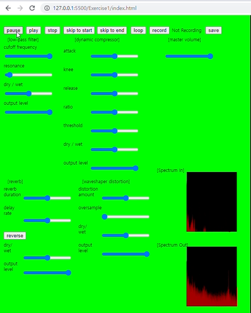
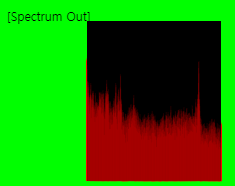
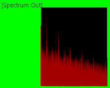
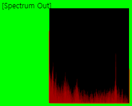

# Exercise1

### 1. The goal of this exercise: 
    To create a web-based audio application using p5.js
    The application should include the following effects: low-pass filter, waveshaper distortion, dynamic compressor, reverb and master volume.
### 2. Result
    2.1 The Application's Screencast Recording

    2.2 The Description of Playback Controls 
        The Record Button: to allow the user to record the processed audio signal in WAV format 
        The Play button: to play soud file. 
        The pause button: to pause current playback. 
        The stop button: to stop current playback.     
        The skip-to-start button: to jump to the start time of current playback. 
        The skip-to-end button: to jump to the end time of current playback 
        The record Button: to record playback. 

    2.3 The effects are connected in a chain 
        player = loadSound("../sounds/exercise1.wav"); 
        low_pass_Filter.process(player); 
        Wave_Shaper_Distortion.process(low_pass_Filter); 
        dynamic_Compressor.process(Wave_Shaper_Distortion);     
        reverb_Filter.process(dynamic_Compressor); 
        master_Volume.setInput(reverb_Filter);     

        The user can listen to the processed audio signal. In the screencast recording you can also listen to the processed audio.  

### 3. An Analysis of the application discussing low pass filter and master volume effects 

    3.1 How the low-pass filter affect the sound's spectrum.
||Before applying lpf|After applying lpf|
|------|---|---|
|Spectrum Output |||
|Description||Now Low Frequncy Components are passed  but High Frequency Components are selectively reduced.|

    3.2 How master volume effect affect the sound's spectrum
||Before Applying Master Volume |After decreasing master volume|
|------|---|---|
|Spectrum Output |||
|Description||All frequncy components are reduced.|
 

