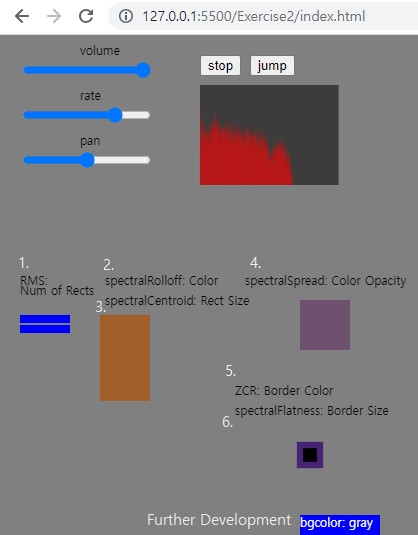
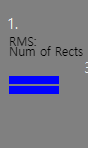
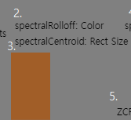
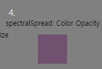
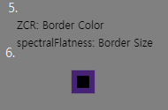
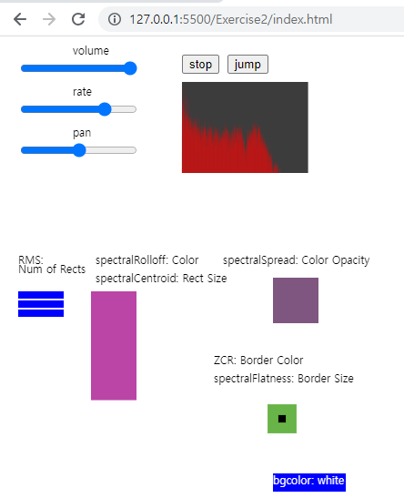
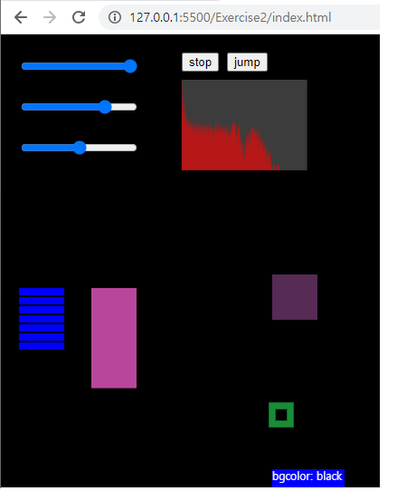

# Exercise2

### 1. Description
    To develop an interactive web-based application for visualising his music. The application must be based on p5.js, p5.speech and the JavaScript audio feature extraction library Meyda   

### 2. tasks
    2.1 The Application's Screencast Recording

    2.2 task: to create the web-based application for audio visualisation.

    This application is based on the 4.108 Exercise 8 Example Code. 

    below functions are added
|Features|Visualisation|Visual Variable|Mappging between Visual Variable and audio feature|
|---|---|---|---|
|1. RMS||The Number of Rectangles|The number of rectangle is changed according to the rms value for(let i=0; (70 * i) < rms_Length ;++i) &nbsp;&nbsp;&nbsp;&nbsp;rect(20, 280 + 10 * i , 50, 8);|
|2. Spectral Rolloff||The Color of Rectangle|The color code of the rectangle is changed according to the spectral rolloff value fill(spectralRolloff_Color, 255 - spectralRolloff_Color,  (spectralRolloff_Color * 5) % 255);|
|3. Spectral Centroid||The Height of Rectangle|The height of the rectnagle is changed according to the value of spectral Centroid rect(100, 280, 50, spectralCentroid_Size);|
|4. Spectral Spread||The Color Opacity of Rectangle|The opacity of the color is changed based on the spectral spread value new_color.setAlpha(spectralSpread_Alpha);|
|5. ZCR||The Border Color of rectangle|The border color code is changed accroding to the value of ZCR stroke((zcr_Color * 10) % 255, (zcr_Color * 5) % 255, (zcr_Color * 2) % 255);|
|6. Spectral Flatness||The Border Size of rectangle|The borderweight is changed according to the value of spectral flatness strokeWeight(spectralFlatness_Width);|

    2.3 Further Development: 
    to change the background color by p5.speech
|Word|Visualisation (Background Color)|    
|---|---|
|'gray'||
|'red'||
|'white'||
|'black'||

    The Mapping Between word and Color Change 
    In the P5.SpeechRec's callback function, the most recent word is parsed.

        var mostrecentword = myRec.resultString.split(' ').pop().toLowerCase(); 

    if the most recent word is in the set of applications background color, the variable bgcolor is changed. 

        if (set_bgcolor.hasKey(mostrecentword))  
            bgcolor = mostrecentword; 

    Then new bgcolor is applied in the draw function 
        background(bgcolor); 

  

