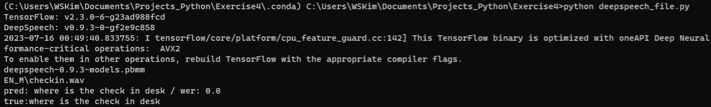

# Exercise4

### 1. The Project Description
    To create a speech recognition system written in python

### 2. The Result
    The Application's Screencast Recording

    2.1 A brief description of the software 
        Source code is composed of one file: deepspeech_file.py 
        This software is based on the 5.209 Offline ASR Source Codes. 
    
        It add two new features  
            One is preprosessing 
            The other is low pass filter 

    2.2 How it has been configured 
        It adds preprocessing to decrease WER Score. 
            The preprocessing is to add some padding in the start time (this is work around for WER score) 
            Numpy concatenate method is used to add some padding 
        It adds low pass filter feature to address noisy environment issue 
            Scipy.signal is used to apply low pass filter 

    2.3 The solution applied to the issue of the noisy environment 
        Low pass filter 
            From scipy Import signal 
            B = signal.firwin(101, cutoff=7500, fs=sample_rate, pass_zero='lowpass') 
            Data = signal.lfilter(b, [1.0], data) 
        An analysis of the result of the best  
            the application passed the test in English (WER 0.219 < 0.25) 
            The application passed the test in Italian (WER 0.250 < 0.35) 
            The application passed the test in spanish (WER 0.274 < 0.35) 
        WER (Word Error Rate) Result Table
|Language|File|WER|
|---|---|---|
|English|Checkin.wav|0.0|
||Checkin_child.wav|1.0|
||Parents.wav|0.2|
||Parents_child.wav|0.2|
||Suitcase.wav|0.167|
||Suitcase_child.wav|0.667|
||What_time.wav|0.2|
||What_time_child.wav|0.2|
||Where.wav|0.0|
||Where_child.wav|0.0|
||Your_sentence1.wav|0.0|
||Your_sentence2.wav|0.0|
||Average|0.219|
|Italian|Checkin_it.wav|0.25|
||Parents_it.wav|0.0|
||Suitcase_it.wav|0.0|
||What_time_it.wav|0.571|
||Where_it.wav|0.429|
||Average|0.250|
|Spanish|Checkin_es.wav|0.25|
||Parents_es.wav|0.0|
||Suitcase_es.wav|0.0|
||What_time_es.wav|0.833|
||Where_es.wav|0.286|
||Average|0.274|
